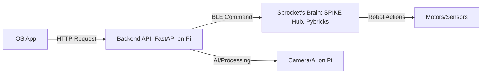

# ⚙️ Sprocket

**Sprocket** is a modular control system for LEGO SPIKE Prime robots. It consists of:

- A Python backend (FastAPI, managed with [uv](https://github.com/astral-sh/uv), or Docker)
- A SwiftUI iOS app for sending control commands to a robot
- LEGO SPIKE Prime hub control via Bluetooth or USB

---

## 🗂️ Monorepo Structure

```
sprocket/
├── backend/            # FastAPI app
│   ├── main.py
│   ├── routes/         # API route definitions (FastAPI)
│   ├── hub/            # SPIKE Prime hub communication (Bluetooth/USB, commands, etc)
│   └── Dockerfile      # backend container definition
├── ios/                # iOS SwiftUI app
├── docker-compose.yml  # orchestrates backend (and future services)
├── README.md
└── .gitignore
```

---

## 🚀 Getting Started

### Backend (FastAPI, Python 3.11+)

#### Option 1: Using Docker (Recommended, especially for Raspberry Pi)

1. **Install Docker and Docker Compose:**
   - `brew install orbstack` (https://orbstack.dev/download)
   - [Docker for Raspberry Pi](https://docs.docker.com/engine/install/)
2. **Build and run the backend:**
   ```bash
   docker compose up --build
   ```
   - The backend will be available at http://localhost:8000
   - Code changes in `backend/` will automatically reload the server

#### Option 2: Using uv (for local Python development)

1. **Install [uv](https://github.com/astral-sh/uv):**
   ```bash
   brew install uv
   ```
2. **Set up the backend:**
   ```bash
   cd backend
   uv venv
   uv pip install -r requirements.txt
   uv run uvicorn main:app --reload
   ```
   - The backend will be available at http://localhost:8000

### iOS App (SwiftUI)

1. Open `ios/SprocketApp.xcodeproj` in Xcode.
2. Select your device or simulator.
3. Build and run the app.

---

## 🛠️ System Architecture Overview

This project consists of several components working together to control Sprocket, the robot:

### Components



- **iOS App:** User interface for sending commands (e.g., “Hey Sprocket, dance for me!”) to the robot.
- **Backend:** Receives commands from the iOS app over HTTP, may use AI (e.g., camera, person detection), and sends commands to the SPIKE Hub via Bluetooth.
- **Sprocket's Brain (SPIKE Prime Hub, Pybricks):** Runs a listener script uploaded via Pybricks, receives commands from the backend, and controls the robot's motors, sensors, and display.

### Deployment Summary

| Component         | Language | Deployment Method        | Runs On         |
|-------------------|----------|--------------------------|-----------------|
| iOS App           | Swift    | Xcode/TestFlight         | iPhone          |
| Backend           | Python   | Docker Compose           | Raspberry Pi    |
| SPIKE Hub Code    | Python   | Pybricks upload          | SPIKE Prime Hub |
